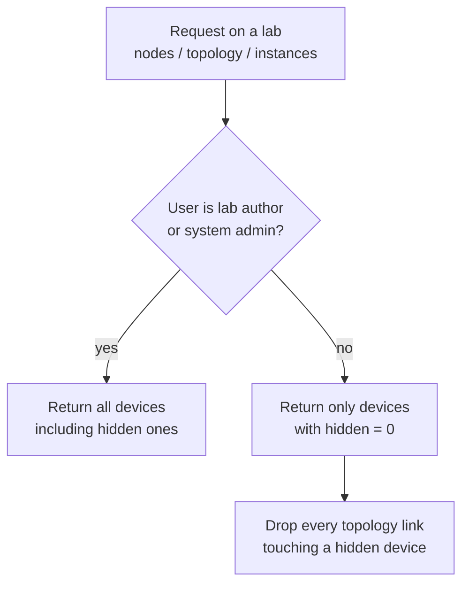
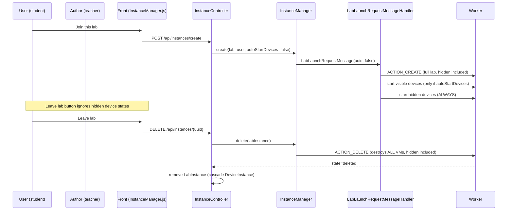

# Hidden Devices — Specification & Implementation Plan

> Status: **spec / not implemented yet**.
> This document describes the expected behaviour of a *hidden device* inside a lab
> and lists every code location that must be changed to implement it.

## 1. Overview

A **hidden device** is a device belonging to a lab that is **invisible to every
user of that lab except its creator** (the lab `author`) and the system
administrators. It is designed for "background" infrastructure a teacher may
need in a lab (a monitoring server, a router injecting traffic, a sink VM, …)
without exposing it to the students.

Key properties:

| Property | Behaviour |
|---|---|
| Visibility | Only the lab **author** and **system admins** see the device (editor, node list, topology, instance list). |
| Network links | Links (connections) touching a hidden device are hidden too — a dangling link would reveal the hidden node. |
| Start | Hidden devices **start automatically** when the lab instance is created, regardless of the `autoStartDevices` flag. |
| Leave lab button | The state of hidden device instances is **ignored** when computing whether *Leave lab* must be disabled. |
| Leave lab | Hidden device instances are **stopped and destroyed** with the rest of the lab instance when the user leaves the lab (no special teardown needed, see §7). |
| Notifications | **No notification** is sent to lab users on hidden device state changes — except to the **lab author**. |

### Who may see a hidden device?

Visibility is decided by a single predicate, reusing the existing editor-rights
rule of `LabVoter` (`src/Security/ACL/LabVoter.php:171-174`):

```php
private function canHaveEditorRights(Lab $lab, User $user)
{
    return ($user->isAdministrator() || $user == $lab->getAuthor());
}
```

The same rule already drives the editor flags (`AUTHOR`, `ROLE`) exposed to the
front by `POST /api/user/rights/lab/{id}` (`src/Controller/EditorController.php:45-126`,
`author` computed at `:56-61`).

## 2. Data model

### 2.1 New field on `Device`

Add a single boolean on the `Device` entity (`src/Entity/Device.php`), next to
`isTemplate` (`:155-159`) which is a good template for the definition style:

```php
#[ORM\Column(type: 'boolean', options: ['default' => 0])]
#[Serializer\Groups(['api_get_device', 'api_get_lab_instance', 'api_get_lab', 'export_lab', 'api_get_lab_template'])]
private $hidden = false;
```

Plus the usual getter/setter (`getHidden()` / `setHidden()`).

Notes:

* The flag is on the **Device**, not on the `lab_device` join table
  (`src/Entity/Lab.php:58-63`). A device shared by several labs would therefore
  be hidden in **all** of them — acceptable today because lab devices are
  created per-lab, but keep it in mind (see §10).
* Do **not** add `hidden` to the `worker` serialization group: the worker has no
  need for it and the flag must stay a front-side concern.
* `export_lab` / `api_get_lab_template`: include it so that a lab template
  export/import preserves the flag (decide during implementation whether the
  import should force `hidden = 0` for safety).

### 2.2 Migration

Follow the conventions of the latest migrations
(`migrations/Version20261009120543.php`):

```php
// migrations/VersionYYYYMMDDHHMMSS.php
public function up(Schema $schema): void
{
    $this->addSql('ALTER TABLE device ADD hidden TINYINT(1) DEFAULT 0 NOT NULL');
}

public function down(Schema $schema): void
{
    $this->addSql('ALTER TABLE device DROP hidden');
}
```

## 3. Visibility: where filtering is required

The rule must be enforced **on the server side** in every endpoint that exposes
the devices or the topology of a lab. Hiding nodes only in the JS editor is not
enough — the REST APIs are the authoritative sources.



### 3.1 Node list — `POST /api/labs/{id}/nodes`

`src/Controller/DeviceController.php:243` (`indexActionTest`), authorized with
`LabVoter::SEE_DEVICE` (`:250`):

* `edition == 1` (editor): `$this->deviceRepository->findByLab($lab)` (`:268`)
  → filter out hidden devices unless the user is author/admin.
* `edition == 0` (live instance view): `$this->deviceRepository->findByLabInstance($labInstance)` (`:258`)
  → same filter, based on `$device->getHidden()`.

Either filter in the repository methods
(`src/Repository/DeviceRepository.php:68` `findByLab`, `:90` `findByLabInstance`)
with an extra `AND d.hidden = 0` parameter, or in the controller loop (`:271`).
Repository-level filtering is preferred so **all** callers are covered at once.

### 3.2 Single node — `POST /api/labs/{labId}/nodes/{id}`

`src/Controller/DeviceController.php:445` — same check before returning the
device: if `$device->getHidden()` and the user is not author/admin → `404`.

### 3.3 Device interfaces — `GET /api/labs/{labId}/nodes/{deviceId}/interfaces`

`src/Controller/DeviceController.php:1882` — same 404 rule, otherwise a hidden
device's interfaces (and their connections) are enumerable.

### 3.4 Topology — `GET /api/labs/{labId}/topology`

`src/Controller/NetworkInterfaceController.php:305` (`LabVoter::SEE_INTERFACE`
at `:309`) → `NetworkInterfaceRepository::getTopology()` (`src/Repository/NetworkInterfaceRepository.php:70-86`),
which groups connections per lab:

```sql
SELECT n.connection, ..., GROUP_CONCAT(d.id) AS devices
FROM NetworkInterface n ... WHERE l.id = :id GROUP BY n.connection, n.vlan
```

For a non-author/non-admin:

1. Exclude interfaces belonging to hidden devices from the query.
2. **Additionally drop any remaining connection whose peer interface belongs to
   a hidden device** (a link between a visible switch and a hidden router must
   not appear, otherwise the hidden device is revealed by the dangling edge).

### 3.5 Lab instances — `api_get_lab_instance` serialization

`LabInstance::$deviceInstances` (`src/Entity/LabInstance.php:27-29`) is
serialized with group `api_get_lab_instance` and is consumed by:

* `GET /api/instances/lab/{labUuid}/by-user/{userUuid}` (`src/Controller/InstanceController.php:814`)
* `GET /api/instances/lab/{labUuid}/by-guest/{guestUuid}` (`:839`)
* `GET /api/instances/lab/{labUuid}/by-group/{groupUuid}` (`:865`)
* the whole "instances" list of the lab page (`InstanceManager.js:113-120` →
  `assets/js/components/API/index.js:872-947`)

Hidden `DeviceInstance`s must be removed from the collection before
serialization for non-author/non-admin users, otherwise students see the hidden
device in the *Instances* panel (`InstanceList`) with its running state.
Implementation options: a JMS Serializer event subscriber, or filtering in the
controller actions above before calling `$this->json(...)`.

### 3.6 Lab payload — `Lab::$devices`

`src/Entity/Lab.php:58-63` serializes the full device collection with group
`api_get_lab` (used by the lab page, `templates/lab/view.html.twig`). The same
filtering concern applies: either strip hidden devices from the collection for
non-privileged users, or ensure the front never renders this collection as a
device list (audit the templates/JS during implementation).

## 4. Graphical editor

### 4.1 Indicator on the node

Nodes are rendered in
`assets/js/components/Editor2/themes/default/js/functions.js:2292-2306`:

```js
$labViewport.append(
    '<div id="node' + value['id'] + '" ...>' +
    ...
    '<div class="node_name"><i class="node' + value['id'] + '_status"></i> ' + value['name'] + '</div>' +
    '</div>');
```

When `value['hidden'] == true` **and** the current user may see hidden devices
(`AUTHOR == 1` or `ROLE` is `ROLE_ADMINISTRATOR`/`ROLE_SUPER_ADMINISTRATOR`,
flags imported at `functions.js:19-21` and computed by `EditorController`), add
an indicator on the node, e.g.:

```js
var hiddenBadge = (value['hidden'] && (AUTHOR == 1 || ROLE == 'ROLE_ADMINISTRATOR' || ROLE == 'ROLE_SUPER_ADMINISTRATOR'))
    ? ' <i class="fa fa-eye-slash" title="Hidden device — invisible to lab users"></i>'
    : '';
// inject hiddenBadge inside the .node_name div
```

A CSS class (e.g. `node-hidden`, slight opacity or dashed border) can be added
in `assets/js/components/Editor2/themes/default/css/unetlab.css` to make the
node visually distinct for the author.

Since hidden devices are filtered server-side for everyone else (§3), no
client-side hiding logic is required for non-authors — the node simply never
arrives.

### 4.2 Toggling the flag

* **Create node**: `POST /api/labs/{labId}/node`
  (`src/Controller/DeviceController.php:780`) — accept a `hidden` field in the
  submitted node data.
* **Edit node**: `PUT /api/labs/{labId}/node/{id}`
  (`src/Controller/DeviceController.php:1400`) — same.
* **Editor form**: the node dialog is built in `functions.js` (~`:1763`,
  `node[type]` hidden inputs and the dynamic form). Add a "Hidden device"
  checkbox next to the other options, only rendered when the user has editor
  rights on the lab (the form is only reachable in `EDITION == 1`, which is
  already restricted to author/admin by `LabVoter::EDIT_DEVICE`, `:89-95`).
* Both endpoints must keep enforcing `LabVoter::EDIT_DEVICE` so a student can
  never flip the flag.

## 5. Lifecycle



### 5.1 Auto-start of hidden devices

Today devices are auto-started only when the launch message carries the flag
(`src/MessageHandler/LabLaunchRequestMessageHandler.php:150-164`):

```php
if ($message->isAutoStartDevices()) {
    foreach ($labInstance->getDeviceInstances() as $deviceInstance) {
        if ($deviceInstance->getState() === STATE_STOPPED || ...STATE_ERROR) {
            $this->instanceManager->start($deviceInstance);
        }
    }
}
```

And the normal *Join lab* path passes `autoStartDevices = false`
(`src/Controller/InstanceController.php:482` → `InstanceManager::create()`,
`src/Service/Instance/InstanceManager.php:175`; front call at
`assets/js/components/Instances/InstanceManager.js:174`).

**Change**: inside the loop (or in a second loop), start every
`DeviceInstance` whose `$deviceInstance->getDevice()->getHidden()` is true,
**even when `isAutoStartDevices()` is false**. Reuse the same
`stopped`/`error` state guard.

The existing auto-start path used by scheduled actions
(`src/Service/Instance/ScheduledActionService.php:149-151`) stays untouched: it
already starts everything.

### 5.2 Leave lab button

The *Leave lab* button is disabled while any device instance is still running
(`src/Component` front `assets/js/components/Instances/InstanceManager.js`):

```js
function hasInstancesStillRunning() {
    return labInstance.deviceInstances.some(i =>
        (i.state !== 'stopped' && i.state !== 'exported' && i.state !== 'error' && i.state !== 'reset'));
}
```
(`:159-161`, used by the button at `:315`)

Because hidden devices auto-start and keep running in background, this check
would keep the button disabled forever. **Change**: ignore hidden device
instances in the predicate:

```js
return labInstance.deviceInstances.some(i =>
    !(i.device?.hidden === true) &&
    (i.state !== 'stopped' && ...));
```

This requires `hidden` to be serialized down to `DeviceInstance.device`
(group `api_get_lab_instance`, see §2.1). For users who are not
author/admin, hidden instances are absent from the payload altogether (§3.5),
so the check is naturally unaffected for them.

The same review must be done for any other place blocking on device states
(`InstanceList`, bulk actions in `OptimizedInstanceList.js`,
`GroupInstancesList.js:263`).

### 5.3 Destruction on leave

No special code is required:

* `DELETE /api/instances/{uuid}`
  (`src/Controller/InstanceController.php:1095`) and the bulk variant
  `DELETE /api/instances/bulk/leave-all` (`:1714`) both call
  `InstanceManager::delete()` (`src/Service/Instance/InstanceManager.php:268`).
* `delete()` serializes the **whole** lab instance (all device instances,
  hidden included) and sends `ACTION_DELETE` to the worker, which destroys the
  VMs. The "no worker assigned" fast path (`:270-283`) only removes database
  rows.
* DB side: `DeviceInstance::$labInstance` has
  `#[ORM\JoinColumn(onDelete: 'CASCADE')]` (`src/Entity/DeviceInstance.php:50-51`)
  and `LabInstance::$deviceInstances` is `cascade: ['persist', 'remove']`
  (`LabInstance.php:27`), so the rows are removed with the lab instance.

Hidden devices are therefore automatically stopped and deleted when any user
leaves the lab, with no additional teardown step.

## 6. Notifications

State-change notifications are emitted by
`src/MessageHandler/InstanceStateMessageHandler.php`:

* errors — `:234` (`notificationService->error(...)`)
* stopped — `:387`, started — `:395`, exported — `:401`
* lab deleted — `:479`, default branch — `:485`

Recipients come from `getUserIdFromInstance()` (`:80-138`): the owning user,
guest, or group owner + group admins.

**Change**: when the notified instance is a `DeviceInstance` whose device is
hidden, replace the recipient list with **only the lab author's ID**
(`$deviceInstance->getLabInstance()->getLab()->getAuthor()->getId()`). System
admins are intentionally *not* notified (they are not watching the lab; the
author is the only one who knows the device exists).

Apply the same rule to the lab-launch failure notification in
`LabLaunchRequestMessageHandler::getNotificationUserIds()`
(`src/MessageHandler/LabLaunchRequestMessageHandler.php:173-199`) if the
failure only concerns a hidden device.

`NotificationService` (`src/Service/NotificationService.php:30-130`) needs no
change: it simply persists one `UserNotification` per ID in `$userIds`.

## 7. Permissions matrix

| Action | Lab author | System admin | Group elevated user | Student / guest |
|---|---|---|---|---|
| See hidden node in editor | ✅ (with indicator) | ✅ (with indicator) | ❌ | ❌ |
| See hidden node in instance view | ✅ | ✅ | ❌ | ❌ |
| See links touching a hidden device | ✅ | ✅ | ❌ | ❌ |
| See hidden device instance in *Instances* panel | ✅ | ✅ | ❌ | ❌ |
| Start / stop / reset a hidden device | ✅ | ✅ | ❌ | ❌ |
| Toggle the `hidden` flag | ✅ | ✅ | ❌ | ❌ |
| Receive notifications about a hidden device | ✅ | ❌ | ❌ | ❌ |
| Blocked by hidden device state on *Leave lab* | ❌ not blocked | ❌ | ❌ | ❌ |

Device control endpoints already go through `InstanceVoter`
(`src/Security/ACL/InstanceVoter.php:14-20`) and the editor through
`LabVoter::EDIT_DEVICE` / `EDIT_INTERFACE`; those checks remain, and the
additional hidden-device check is only about **reading**.

## 8. Action checklist

Ordered list of the concrete changes, with file references.

1. **Entity + migration**
   - [ ] Add `$hidden` to `src/Entity/Device.php` (near `:155`) with
         serializer groups `api_get_device`, `api_get_lab_instance`,
         `api_get_lab`, `export_lab`, `api_get_lab_template` (not `worker`).
   - [ ] Create `migrations/VersionYYYYMMDDHHMMSS.php` (see §2.2).

2. **Server-side filtering**
   - [ ] `src/Repository/DeviceRepository.php:68` `findByLab()` and `:90`
         `findByLabInstance()` — add `includeHidden` parameter (default
         `false`).
   - [ ] `src/Controller/DeviceController.php:243` `indexActionTest()` — call
         the repositories with `includeHidden = true` only for
         author/admin.
   - [ ] `src/Controller/DeviceController.php:445` single node — 404 on hidden
         device for non-privileged users.
   - [ ] `src/Controller/DeviceController.php:1882` interfaces — same.
   - [ ] `src/Repository/NetworkInterfaceRepository.php:70` `getTopology()` +
         `src/Controller/NetworkInterfaceController.php:305` — exclude hidden
         devices and connections touching them for non-privileged users.
   - [ ] Lab instance serialization: filter hidden `DeviceInstance`s in
         `InstanceController.php:814`, `:839`, `:865` (or via a JMS event
         subscriber) for non-privileged users.
   - [ ] Audit `Lab::$devices` exposure (`src/Entity/Lab.php:62`, group
         `api_get_lab`).

3. **Editor**
   - [ ] `assets/js/components/Editor2/themes/default/js/functions.js:2292-2306`
         — render the `fa-eye-slash` badge (and CSS class) when
         `value['hidden']` and user is author/admin.
   - [ ] Node create/edit forms + `DeviceController.php:780` / `:1400` —
         handle the `hidden` toggle (checkbox, author/admin only).

4. **Lifecycle**
   - [ ] `src/MessageHandler/LabLaunchRequestMessageHandler.php:150-164` —
         always start hidden device instances, whatever
         `isAutoStartDevices()`.
   - [ ] `assets/js/components/Instances/InstanceManager.js:159-161` — exclude
         hidden device instances in `hasInstancesStillRunning()` (and audit
         other UI blockers, §5.2).

5. **Notifications**
   - [ ] `src/MessageHandler/InstanceStateMessageHandler.php` — for hidden
         device instances, notify only the lab author (replace the result of
         `getUserIdFromInstance()` at the call sites of
         `:234`, `:387`, `:395`, `:401`, `:485`).
   - [ ] Same rule in
         `LabLaunchRequestMessageHandler::getNotificationUserIds()` (`:173`).

6. **Tests**
   - [ ] See §9.

## 9. Testing scenarios

| # | Scenario | Expected result |
|---|---|---|
| 1 | Author opens the editor | Hidden nodes visible with the eye-slash indicator; links visible. |
| 2 | Student opens the same lab view (`/labs/{id}/see/{instanceId}`) | Hidden nodes absent from the canvas; no dangling links. |
| 3 | Student calls `POST /api/labs/{id}/nodes` / `GET .../topology` directly | Hidden devices/connections absent from the JSON. |
| 4 | Student opens the lab page *Instances* panel | Hidden device instance not listed. |
| 5 | Student joins the lab | Visible devices stopped; hidden devices started automatically. |
| 6 | Author joins the lab | Same auto-start of hidden devices. |
| 7 | Student clicks *Leave lab* while a hidden device runs | Button is enabled; leaving destroys everything. |
| 8 | Author clicks *Leave lab* while a hidden device runs | Button enabled (hidden state ignored); hidden VM destroyed on worker. |
| 9 | Hidden device changes state (started/stopped/error) | Only the lab author receives a notification; no one else. |
| 10 | Student tries `PUT /api/labs/{labId}/node/{id}` with `hidden: 1` | Denied (`LabVoter::EDIT_DEVICE`). |
| 11 | Non-author fetches `POST /api/labs/{id}/nodes/{hiddenId}` | 404. |
| 12 | Lab template export/import | `hidden` flag preserved (or explicitly reset — record the chosen behaviour here once decided). |

## 10. Known limitations / open points

* **Flag lives on `Device`, not on the lab↔device relation.** If a device were
  linked to several labs (`Lab::$devices` M2M, `src/Entity/Lab.php:63`), it
  would be hidden in all of them. Today devices are created inside a single lab,
  so this is acceptable; a per-lab flag would require a `lab_device.hidden`
  column and touching every join query.
* **Guests** (`InvitationCode`) follow the same filtering: they are neither
  author nor admin, so they never see hidden devices. Verify the guest view
  (`templates/lab/guest_view.html.twig`, `EditorController.php:83-97`) during
  implementation.
* **Admin instance lists** (`AllInstancesList`, admin console) keep showing
  everything — that is intentional for support purposes.
* Decide whether lab **import** (`LabController.php:1591`, group `export_lab`)
  keeps or resets the `hidden` flags of the imported devices.
